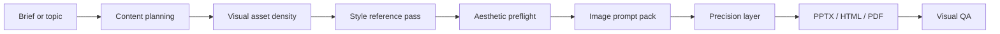

<div align="center">

# Steven SuperPPT Skill

**A public presentation-design skill for turning rough ideas into polished, high-aesthetic PPT decks.**

<p>
  
  
  
  
</p>

**Plan the story. Extract the style. Generate the plates. Keep the real meaning editable.**

</div>

---

## Why This Exists

Most AI slide workflows fail in one of two ways: the deck has decent copy but bland visuals, or the visuals look impressive while the important text and numbers are trapped inside flat images.

Steven SuperPPT uses a two-layer production model:

| Layer | What it handles | Why |
|---|---|---|
| Image plate | Atmosphere, metaphor, texture, background structure, object mood | Let image generation do what it is good at |
| Precision layer | Text, numbers, charts, labels, diagrams, tables, page furniture | Keep the deck editable, auditable, and presentation-safe |

The result is a deck workflow that can feel like a keynote, but still behave like a real PowerPoint file.

## Workflow



## Core Capabilities

| Capability | What the skill does |
|---|---|
| Slide-by-slide planning | Builds a complete `outline.md` with stable slide IDs, polished headlines, page jobs, speaker intent, evidence status, visual jobs, and asset needs |
| Style reference adaptation | Reads screenshots, decks, PDFs, websites, logos, product photos, or moodboards and turns them into reusable visual-system rules |
| Visual asset density control | Lets the user choose `lean`, `standard`, `image-rich`, or `auto` before image planning starts |
| Multi-image planning | Creates an `imagegen-prompt-pack.md` instead of assuming one image is enough |
| Prompt handoff mode | When direct image generation is unavailable, writes copy-ready prompts and expected filenames for external tools |
| Hybrid production | Uses image plates for mood and HTML/SVG/Canvas/PPTX for exact layout, charts, labels, and editable text |
| Verification discipline | Requires visual inspection, asset manifest checks, and PPTX/HTML parse or preview checks before calling the deck done |

## Visual Asset Density

Choose how image-rich the deck should be at startup:

| Mode | Best for | Image strategy |
|---|---|---|
| `lean` | Information-first reports, analysis, legal, compliance, board updates | Cover, major section, and essential metaphor plates only |
| `standard` | Polished business decks and most general presentations | Cover variants, section plates, and key-slide visuals |
| `image-rich` | Launch events, keynotes, product demos, campaign decks, cinematic decks | One planned visual asset per slide, with extra variants for hero, product, and transition slides |
| `auto` | You want the agent to decide | Infers a mode from the brief and records the reason |

If the user says "launch", "keynote", "product demo", "Apple-style", "cinematic", or "visual impact", the skill automatically upshifts to `image-rich`.

## Image Generation Rules

Every image prompt is optimized for slides, not generic wallpaper:

- 16:9 presentation composition
- safe zones for titles, body copy, and charts
- no readable text inside generated images
- no fake logos, UI, labels, charts, dashboards, or watermarks
- low-density content areas for overlays
- explicit `overlay_plan` so text, numbers, labels, and claims are drawn later
- acceptance criteria for each generated or externally produced plate

## Prompt-Handoff Mode

If the agent environment cannot generate images directly, the skill still plans the visuals and writes:

```text
references/imagegen-prompt-pack.md
references/imagegen-handoff.md
references/asset-manifest.json
```

The user can generate images in any external tool, save them to the expected paths, and continue the deck build.

## Install

Copy the skill folder into your agent's skills directory:

```text
~/.codex/skills/steven-superppt-skill/
```

Expected structure:

```text
steven-superppt-skill/
  SKILL.md
  agents/openai.yaml
  assets/samples/uffizi-main-works.pptx
  references/
```

## Quick Prompts

Balanced default:

```text
Use $steven-superppt-skill to turn this topic into a polished 12-page presentation.
```

Launch or keynote:

```text
Use $steven-superppt-skill with image-rich visual asset density to create a product launch keynote deck.
```

With style references:

```text
Use $steven-superppt-skill. Use these screenshots as the style reference, plan the deck page by page, then produce PPTX and HTML preview outputs.
```

Without image generation:

```text
Use $steven-superppt-skill in prompt-handoff mode. Create the external image prompts, asset manifest, and deck draft.
```

## Sample

The repository includes an editable sample deck:

```text
steven-superppt-skill/assets/samples/uffizi-main-works.pptx
```

It demonstrates a 12-slide museum-style presentation with embedded artwork imagery and editable text.

## Public Sharing Notes

This repository is designed for public sharing. It avoids private company references, local machine paths, and brand-specific rules. Add your own brand or template skill separately when you need strict house style.
